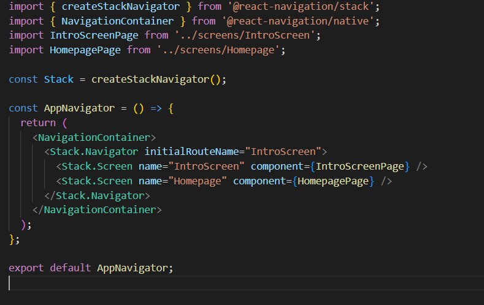
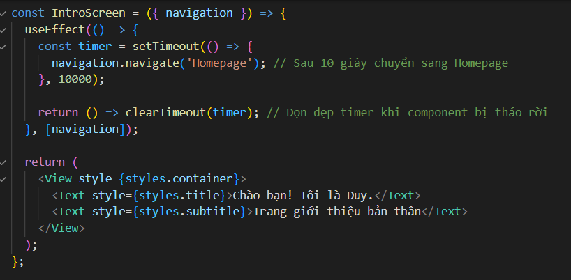
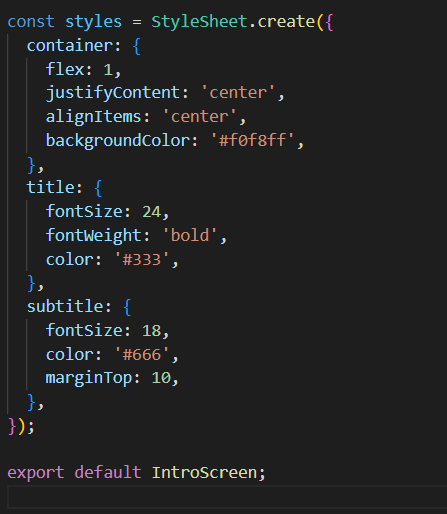
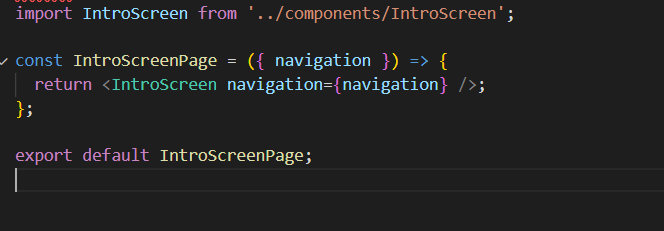
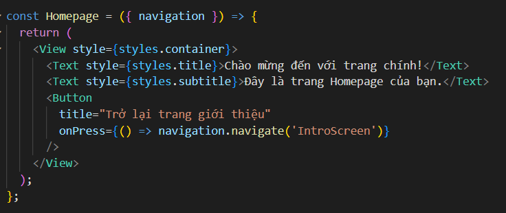
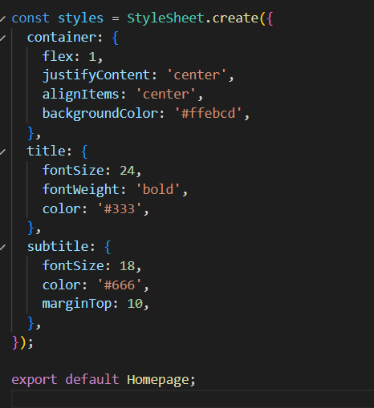
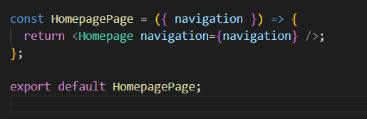

1. Cài Đặt Môi Trường

Trước khi bắt đầu, bạn cần cài đặt môi trường phát triển React Native. Hãy làm theo hướng dẫn trên trang chủ của React Native: React Native Getting Started.

Các bước cài đặt cơ bản:

Cài đặt Node.js: Tải và cài đặt Node.js từ nodejs.org.

Cài đặt React Native CLI: Chạy lệnh sau trong terminal để cài đặt React Native CLI.
npm install -g react-native-cli

Cài đặt Android Studio để chạy ứng dụng trên thiết bị Android.

2. Khởi Tạo Dự Án

Sau khi môi trường đã được cài đặt, tạo một dự án mới bằng cách sử dụng lệnh sau:
npx @react-native-community/cli init BaiTap01

3. Cài Đặt Các Thư Viện

Để sử dụng React Navigation cho việc điều hướng giữa các màn hình, cài đặt các thư viện cần thiết:

npm install @react-navigation/native @react-navigation/stack react-native-screens react-native-safe-area-context
npm install react-native-gesture-handler react-native-reanimated

4. Cấu Hình Điều Hướng (Navigation)

Tạo thư mục navigation trong src và tạo file AppNavigator.js để cấu hình các màn hình trong ứng dụng.

5. Tạo Các Màn Hình và Thành Phần

a. Màn Hình Giới Thiệu Bản Thân (IntroScreen)
Tạo thư mục screens trong src và thêm file IntroScreen.js. Trang này sẽ hiển thị thông tin giới thiệu bản thân và tự động chuyển sang trang tiếp theo sau 10 giây.

b. Màn Hình Homepage
Tạo file Homepage.js trong thư mục screens và components để hiển thị nội dung chính và nút quay lại trang giới thiệu.

6. Chạy Ứng Dụng
Android: npx react-native run-android

Ứng dụng sẽ hiển thị màn hình "IntroScreen" trong 10 giây và tự động chuyển sang trang "Homepage". Có thể quay lại màn hình giới thiệu từ trang "Homepage".
